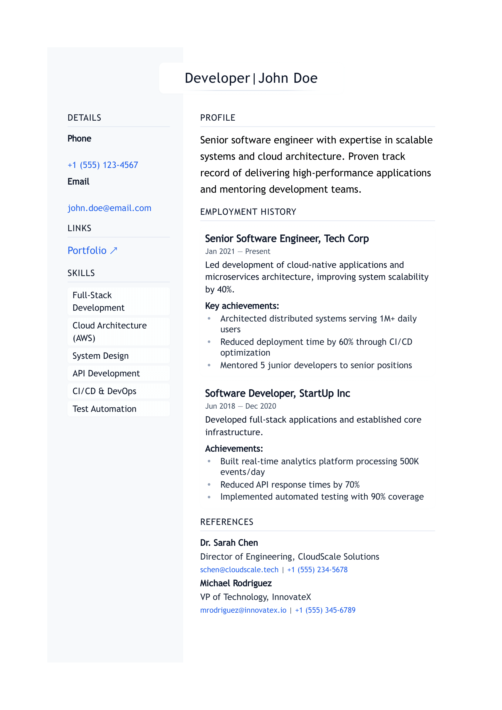

# Markdown CV Generator

A modern, minimalist CV/resume generator that converts markdown to beautifully styled PDF documents. Built with Node.js, Express, and Tailwind CSS.

## Features

- 📝 Write your CV in simple Markdown
- 🎨 Modern, professional design with customizable styles
- 🌓 Light and dark themes available
- 🖨 Export to PDF with perfect formatting
- 💻 Live preview during development
- 🎯 Responsive layout with proper A4 sizing
- ⚡ Fast and lightweight

## Installation

```bash
# Clone the repository
git clone https://github.com/yourusername/Markdown-CV-Generator.git
cd Markdown-CV-Generator

# Install dependencies
npm install

# Install globally for CLI usage
npm install -g .
```

## Usage

### Quick Start

1. Edit `example.md` with your CV content
2. Generate PDF with default light theme:
```bash
markdowncv build --default
```

Or use the dark theme:
```bash
markdowncv build --default-dark
```

Generate with the new soft light theme (easier on the eyes):
```bash
markdowncv build --light
```

The generated PDF will be saved as `[title]-[name]-resume.pdf` in the project root.

Example: 


### Development Mode

Start the development server to preview changes in real-time:

```bash
npm run dev
```

This will:
- Start a local server at http://localhost:3000
- Watch for changes in your markdown and CSS files
- Auto-reload when changes are detected

To preview different themes in development mode:
```
http://localhost:3000?theme=light  # For the new light theme
http://localhost:3000?theme=dark   # For the dark theme
```

## Customization

### Styling

The CV uses Tailwind CSS for styling. Main style files:
- `src/styles/input.css`: Base styles and components
- `src/styles/themes/`: Theme directory containing light and dark themes

### Available Themes

1. Default Light Theme (`--default`)
   - Clean, professional design with white background
   - Optimal for printing and traditional CV submissions

2. Default Dark Theme (`--default-dark`)
   - Modern dark mode with careful color selection
   - Perfect for digital viewing and tech-focused roles
   - Automatically converts to light theme when printing

3. Soft Light Theme (`--light`)
   - Easy on the eyes with softer colors and reduced contrast
   - Elegant typography with improved readability
   - Subtle shadows and rounded corners for a modern feel
   - Perfect for both digital viewing and printing

### Creating New Themes

1. Create a new theme file in `src/styles/themes/`:
```css
/* src/styles/themes/custom.css */
@layer components {
  .custom-theme {
    /* Your styles */
  }
}
```

2. Update the CLI to support your theme:
```javascript
program
  .option('--theme <n>', 'Use custom theme')
  .action(async (options) => {
    const theme = options.theme || 'default';
    // Theme handling logic
  });
```

## Commands

- `markdowncv build --default`: Generate PDF with default light theme
- `markdowncv build --default-dark`: Generate PDF with dark theme
- `markdowncv build --light`: Generate PDF with soft light theme
- `markdowncv serve`: Start development server
- `npm run dev`: Start development environment
- `npm run build:css`: Build CSS only

## Technical Details

- **PDF Generation**: Uses Puppeteer for high-quality PDF export
- **Markdown Processing**: markdown-it for parsing
- **Styling**: Tailwind CSS for utility-first styling
- **Development**: Express server with hot reload

## Contributing

1. Fork the repository
2. Create your feature branch: `git checkout -b feature/amazing-feature`
3. Commit your changes: `git commit -m 'Add amazing feature'`
4. Push to the branch: `git push origin feature/amazing-feature`
5. Open a Pull Request

## License

This project is licensed under the MIT License - see the LICENSE file for details.

## Acknowledgments

- Built with Node.js and Express
- Styled with Tailwind CSS
- PDF generation powered by Puppeteer
- Markdown parsing by markdown-it